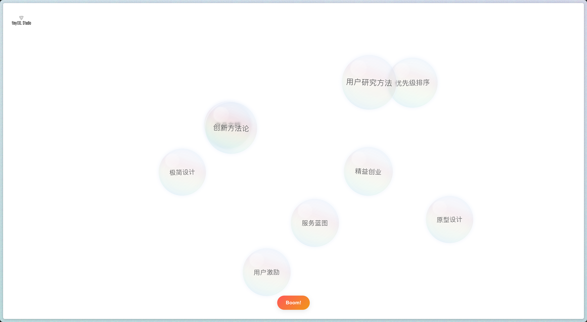

# 灵感气泡（Bubble Thoughts）

[](https://github.com/tinyxxl/bubble/actions/workflows/static.yml)

一个以动态气泡视觉化呈现产品思维主题的互动应用。气泡以柔和的动画方式围绕屏幕中心浮动，点击气泡可以查看详细内容。



## 功能特点

- **动态气泡展示**：每次随机显示9个产品思维相关主题的气泡
- **中心聚拢效果**：所有气泡以屏幕中心为原点，形成有机的聚拢布局
- **大小对应内容**：气泡大小与主题文字长度成正比，直观展示内容权重
- **流畅动画效果**：气泡随机浮动并动态变换，模拟真实肥皂泡效果
- **无重叠设计**：智能布局算法确保气泡之间不会重叠
- **详细信息弹窗**：点击任意气泡查看完整的主题描述
- **一键刷新**：点击"Boom!"按钮重新生成气泡布局和内容

## 内容覆盖

应用包含100个产品思维相关主题，涵盖：

- 设计思维与方法论
- 用户体验与用户研究
- 产品策略与管理
- 创新方法与灵感激发
- 数据分析与决策优化
- 团队协作与沟通

## 技术实现

- **前端框架**：React 19 + Vite 6
- **布局算法**：结合高斯分布和网格系统的智能布局
- **动画效果**：CSS关键帧动画与React状态管理结合
- **响应式设计**：适配不同屏幕尺寸，自动调整布局

## 开始使用

1. 克隆仓库
```bash
git clone https://github.com/tinyxxl/bubble.git
cd bubble
```

2. 安装依赖
```bash
npm install
```

3. 启动开发服务器
```bash
npm run dev
```

4. 构建生产版本
```bash
npm run build
```

## 部署到GitHub Pages

该项目已配置自动部署到GitHub Pages：

1. 确保你的仓库设置中启用了GitHub Pages（Settings > Pages）
2. 在Source设置中选择"GitHub Actions"
3. 每次推送到main分支时，工作流会自动构建并部署应用
4. 部署完成后，应用可在 `https://<your-github-username>.github.io/bubble/` 访问

手动配置步骤：

1. 确保`vite.config.js`中设置了正确的base路径：
```js
export default defineConfig({
  plugins: [react()],
  base: '/bubble/', // 改为你的仓库名
})
```

2. 在`.github/workflows`目录中添加部署工作流配置
3. 推送更改到GitHub仓库

## 自定义主题

可以通过编辑 `src/data/bubbles.json` 文件来自定义主题内容。每个主题包括：

- `id`：唯一标识符
- `text`：显示在气泡中的标题
- `description`：点击气泡后显示的详细描述

## 许可证

MIT
